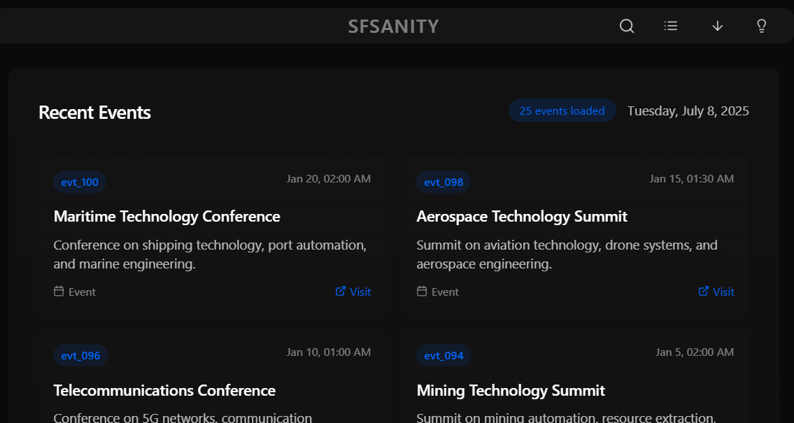

# SFSanity

Event aggregator and filter for San Francisco. Discover and manage tech events, conferences, and meetups.

## Features

- **Events**: Show lu.ma events fetched from Supabase database.
- **Search**: Fuzzy search with Fuse.js, supports searching by title, location, date, time, or link. Returns up to 50 results.
- **View Mode**: Toggle between tile and list view modes.
- **Responsive Design**: Fully responsive layout for mobile and desktop devices.
- **Connection Status**: Real-time monitoring of database connection status.
- **Error Handling**: Graceful error handling with user-friendly messages.
- **Navigation**: CommandBar for quick navigation between main sections.
- **Insights**: About section displaying application version and TODOs.

### TODO

- **Filter**: Filter for different types, e.g. summits, meetups, after-parties
- **Analyze**: Screen the event titles and descriptions for trends, keywords, count, provider
- **Other Event Feeds**: Add other providers of event feeds

## Screenshots

  
Tile View

  

  
List View

  

## Technologies Used

-   React
-   TypeScript
-   Tailwind CSS
-   Supabase
-   Framer Motion
-   Lucide React
-   Fuse.js
-   Vite

## Configuration

The application uses environment variables for configuration.  Create a `.env` file based on the `.env.example` file.

-   `VITE_SUPABASE_URL`:  The URL of your Supabase project.
-   `VITE_SUPABASE_ANON_KEY`:  The anonymous key for your Supabase project.

See [src/config/app.ts](https://github.com/sfsanityorg/sfsanity/blob/main/src/config/app.ts) for additional configuration options, including database target table and event ordering.

## Scripts

-   `dev`: Runs the application in development mode.
-   `build`: Builds the application for production.
-   `lint`: Runs ESLint to check for code quality issues.
-   `preview`:  Previews the built application.

## Database

The Supabase database schema is defined in [supabase/create_events_dev.sql](https://github.com/sfsanityorg/sfsanity/blob/main/supabase/create_events_dev.sql). The target table is configured in [src/config/app.ts](https://github.com/sfsanityorg/sfsanity/blob/main/src/config/app.ts) as `DATABASE_TARGET_TABLE`.

## Hooks

-   [src/hooks/useEvents.ts](https://github.com/sfsanityorg/sfsanity/blob/main/src/hooks/useEvents.ts): Fetches and manages events data from Supabase, including real-time updates.
-   [src/hooks/useSearch.ts](https://github.com/sfsanityorg/sfsanity/blob/main/src/hooks/useSearch.ts): Implements fuzzy search functionality using Fuse.js.

## Components

-   [src/components/common/ConnectionStatus.tsx](https://github.com/sfsanityorg/sfsanity/blob/main/src/components/common/ConnectionStatus.tsx): Monitors and displays the database connection status.
-   [src/components/common/SearchBar.tsx](https://github.com/sfsanityorg/sfsanity/blob/main/src/components/common/SearchBar.tsx): Reusable search bar component.
-   [src/components/common/SearchResults.tsx](https://github.com/sfsanityorg/sfsanity/blob/main/src/components/common/SearchResults.tsx): Displays search results with highlighting.
-   [src/components/layout/CommandBar.tsx](https://github.com/sfsanityorg/sfsanity/blob/main/src/components/layout/CommandBar.tsx): Fixed navigation bar at the bottom of the screen for easy access to main sections.
-   [src/components/layout/TopNav.tsx](https://github.com/sfsanityorg/sfsanity/blob/main/src/components/layout/TopNav.tsx): Top navigation bar containing search, view mode toggle, and insights button.
